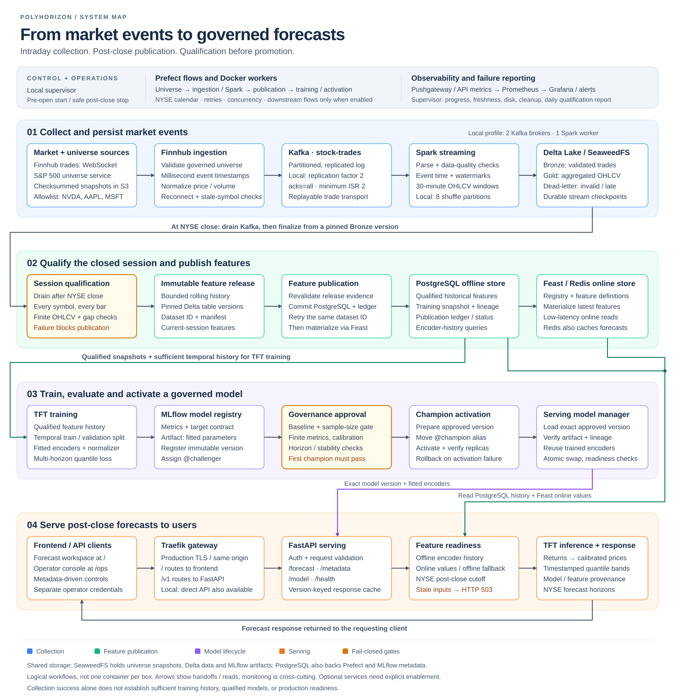

# polyhorizon
This project implements a Temporal Fusion Transformer (TFT) architecture to predict stock prices across multiple time horizons. Unlike traditional RNNs or LSTMs, the TFT is designed to handle the complexity of financial markets by simultaneously processing multi-variable inputs and identifying long-term dependencies.

## End-to-End Architecture

PolyHorizon collects trades during NYSE market hours, but its product contract is
**post-close forecasting**, not live intraday forecast updates. The 30-minute
frequency describes feature and prediction bars; publication follows completion
and qualification of the market session.

[](docs/assets/system-architecture.svg)

*The full static system map is displayed above. Click it to view at full size.
Blue = collection; green = feature publication; purple = model lifecycle;
orange = serving; amber = qualification gates.*

[**Interactive architecture map**](docs/architecture.html): hover over a stage to
unfold its details; click/tap to pin it open. Keyboard users can Tab to a stage
and press Enter/Space. Color identifies each phase; amber outlines mark gates.

GitHub renders README images statically and shows HTML files as source. To use
the interactive map, open `docs/architecture.html` directly in your browser from
your local checkout—no server, dependencies or running containers required.

<details>
<summary>Read the detailed flow and deployment boundaries</summary>

### How to read the system flow

1. **Collect and persist.** The universe service publishes validated, checksummed
   S&P 500 snapshots. Finnhub ingestion resolves that universe and applies the
   product allowlist (`NVDA`, `AAPL`, `MSFT`) before streaming normalized trades
   into Kafka's `stock-trades` topic. Spark validates event-time records, writes
   Bronze Delta trades, aggregates 30-minute Gold OHLCV, and routes invalid or
   late data to a dead-letter table. SeaweedFS supplies S3-compatible persistence
   for the tables and checkpoints.
2. **Qualify, then publish.** After the actual exchange close, Spark drains
   available trades and recomputes closed bars from a pinned Bronze version.
   Full-session symbol/bar coverage, finite positive values and trade-gap checks
   must pass before an immutable feature release is produced. Rolling features
   use bounded prior history; the release carries dataset identity, Delta
   versions and qualification evidence. When publication is enabled, the feature
   service revalidates the release, commits PostgreSQL features and ledger state,
   then materializes Feast features into Redis. A failed online write can be
   retried for the same dataset; PostgreSQL and Redis are not one atomic transaction.
3. **Train and govern.** Qualified PostgreSQL snapshots supply the TFT training
   pipeline. Time-based train/validation separation and fitted preprocessing
   parameters preserve train/serve consistency. MLflow records experiment lineage,
   artifacts and an immutable model version assigned to `@challenger`. Governance
   requires baseline performance, minimum evaluation samples, finite metrics,
   calibration and configured horizon/stability checks—even for the first champion.
   Approved versions are prepared on serving replicas before `@champion` moves;
   activation verifies readiness and attempts rollback if activation fails.
4. **Serve the product.** The frontend reads the API metadata contract and sends
   forecast requests to FastAPI, through Traefik in the production topology.
   Serving loads the exact governed model version, obtains offline encoder
   history plus available Feast online values, and enforces the NYSE post-close
   freshness cutoff. TFT outputs are converted into calibrated price forecasts
   with quantile bands, market-calendar timestamps and model/feature provenance.
   Stale features fail closed; caches are model-version keyed and freshness checked.

### Control plane and deployment boundaries

- **Orchestration:** Prefect owns universe, ingestion, streaming, publication,
  training and activation flows. The local macOS supervisor handles pre-open
  infrastructure startup, progress checks, reports and safe post-close shutdown.
  See [automatic collection](docs/AUTOMATED_COLLECTION.md).
- **Observability:** jobs publish metrics to Pushgateway; serving exposes API
  metrics. Prometheus, Grafana and Alertmanager provide the monitoring stack
  when enabled. The local supervisor also checks offsets, Bronze progress,
  freshness, available disk space and session cleanup.
- **Low-memory local topology:** two Kafka brokers (replication factor 2,
  minimum ISR 2), one Spark worker, eight Gold shuffle partitions, and bounded
  process/container memory. Optional dashboards, materialization and training
  are not part of the collection-only startup. Use the
  [low-memory profile](docs/LOW_MEMORY_LOCAL.md), not the full-stack commands below.
- **Readiness boundary:** the diagram describes the implemented system, not a
  claim that every component is running or production-qualified. Collection-only
  runs stop at qualification; publication, training and champion activation need
  explicit enablement and their own gates. One qualified session alone is not
  sufficient history for a production TFT.

For publication timing and failure semantics, see the
[post-close forecast contract](docs/FORECAST_PUBLICATION_CONTRACT.md),
[dataset publication](docs/DATASET_PUBLICATION.md), and
[session qualification runbook](docs/OPERATIONAL_QUALIFICATION.md).

</details>

### Core services

- **Ingestion**: Stream normalized trades into Kafka using the governed symbol universe.
- **Streaming**: Kafka → Spark → Delta tables for real‑time aggregation.
- **Features (Feast)**: Offline/online feature store and materialization.
- **Training**: TFT model training + MLflow registry.
- **Serving**: FastAPI service that loads the champion model and serves forecasts.
- **Frontend**: Forecasting workspace at `/` and operator-restricted console at
  `/ops`, sharing a responsive Vite application and backend metadata contract.

For service ownership, key capabilities, data contracts, and the complete model
lifecycle, see [`docs/SYSTEM_SERVICES.md`](docs/SYSTEM_SERVICES.md). Detailed
training behavior is documented in
[`polyhorizon/training/README.md`](polyhorizon/training/README.md).

## Frontend ↔ Backend Integration
The frontend calls the serving API endpoints directly:
- `/v1/forecast`
- `/v1/metadata` and `/v1/features` (product controls and observed history)
- `/v1/model`
- `/v1/health`
- `/v1/features/debug`
- `/v1/ops/session` (separate operator-key authorization)

The redesigned workspace uses an ivory/charcoal/teal palette, observed history
plus forecast quantiles, explicit data freshness and target timestamps, and an
opt-in synthetic demo when live services are unavailable. See
[`docs/FRONTEND_REDESIGN.md`](docs/FRONTEND_REDESIGN.md) for the implementation,
verification checklist, and operator credential migration.

In production, Traefik serves both frontend and API on a **single domain**, so there are no CORS issues:
- `https://app.example.com` → frontend
- `https://app.example.com/v1/*` → serving

Internal UIs can be exposed via Traefik subdomains:
- `https://mlflow.example.com`
- `https://prefect.example.com`
- `https://grafana.example.com`
- `https://prometheus.example.com`
- `https://alertmanager.example.com`
- `https://traefik.example.com`

## Environments
- **Local/Dev**: use `docker-compose.yaml` for development and testing.
- **Production**: use `docker-compose.prod.yaml` for long‑running services and deployments.

See `PRODUCTION.md` for the full deployment strategy and commands.

See `SYSTEM_AUDIT.md` for the project-wide architecture audit, fixes applied, verification results, and the prioritized path to production readiness.

## Quick Start (Local/Dev)
```bash
docker compose up -d --build
```

### Spark Image Build (Local/Dev)
If you are building the Spark image explicitly:
```bash
docker compose build spark-master spark-worker
docker compose up -d --build --scale spark-worker=2
```

## Quick Start (Production)
```bash
docker compose -f docker-compose.prod.yaml up -d
```

### Production Deploy Helper
```bash
make deploy-prod ENV_FILE=.env.prod COMPOSE_FILE=docker-compose.prod.yaml
```

Production images in `docker-compose.prod.yaml` use immutable tags via `IMAGE_TAG`.

For local‑stack CI/CD, use a self‑hosted GitHub Actions runner (see `PRODUCTION.md`).


### Docker compose (prod)
- **Core infra**: Postgres, SeaweedFS (master/volume/filer/s3 + bucket init), Redis
- **Streaming infra**: Zookeeper, Kafka (3 brokers + topic init), Spark master + 2 workers
- **ML & orchestration**: MLflow, Prefect server + 4 workers (training/features/ingestion/streaming)
- **Monitoring**: Prometheus, Grafana, Alertmanager, Pushgateway
- **Runtime**: `model-serving`, `frontend`, `traefik`

The long‑running `spark-streaming-service` is disabled by default in prod and can be started manually:
```bash
docker compose -f docker-compose.prod.yaml --profile manual-streaming up -d spark-streaming-service
```

## Streaming Version Drift Guardrails

For an isolated, synthetic-data check of Kafka ingestion, Spark checkpoint
restart, and live Prefect scheduling through Feast/Redis, follow the
[Kafka/Prefect rehearsal guide](docs/KAFKA_PREFECT_REHEARSAL.md). It does not
enable production schedules or contact Finnhub.

Spark package versions are now centralized to prevent drift between Docker, configs, and code:
- `docker/spark/versions.env` is the **single source of truth**
- `polyhorizon/streaming/configs/spark_features.yaml` reads versions from env
- `docker/spark/Dockerfile` downloads JARs using the same env values


Current pinned versions:
- Delta Spark: `3.3.2`
- Spark SQL Kafka: `3.5.7`
- Hadoop AWS: `3.3.4`
- AWS SDK Bundle: `1.12.262`


```
docker compose build spark-master spark-worker
docker compose up -d --build --scale spark-worker=2
```
