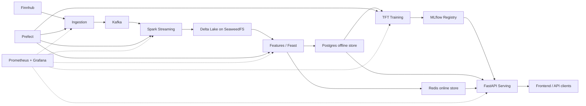

# PolyHorizon System Services

This document records the key capabilities and operational boundaries of each
service in the PolyHorizon forecasting system. Service-specific READMEs remain
the source of truth for detailed commands and configuration.

## End-to-End Request and Model Lifecycle

## S&P 500 Universe Service

Location: `polyhorizon/sp500_data`

Key capabilities:

- Fetches, normalizes, and validates the S&P 500 company universe with bounded
  retries and fail-closed count, schema, symbol, duplicate, and churn gates.
- Publishes immutable point-in-time snapshots plus a checksummed lineage
  manifest, then atomically activates `universe/current.json`.
- Retains compatibility artifacts while ingestion and features resolve and
  verify the governed immutable snapshot.
- Rejects stale, tampered, incomplete, or unsupported universe versions before
  downstream computation starts.
- Runs through Prefect before market open with retries, timeouts, concurrency
  control, immutable images, and auditable run metadata.

## Ingestion Service

Location: `polyhorizon/ingestion`

Key capabilities:

- Maintains the Finnhub WebSocket connection and symbol subscriptions.
- Publishes normalized trade events into Kafka.
- Includes a consumer path for batching, processing, and health reporting.
- Runs through Prefect during NYSE market hours and exits at market close.
- Pushes operational health metrics to Prometheus Pushgateway.

## Kafka and Schema Registry

Compose services: `kafka-broker-*`, `kafka-topic-init`, `schema-registry`

Key capabilities:

- Three-broker event transport for resilient trade ingestion.
- Automated topic initialization during environment startup.
- Schema Registry service for governed event-schema evolution.
- Internal and host listener separation for Docker and local clients.

## Streaming Service

Location: `polyhorizon/streaming`

Key capabilities:

- Parses Kafka events and applies event-time and data-quality checks.
- Routes invalid or late records into a dead-letter Delta table.
- Writes valid trades to Bronze Delta and aggregated OHLCV bars to Gold Delta.
- Finalizes Gold from a drained, pinned Bronze version at market close and
  computes immutable feature releases with durable completion manifests.
- Uses centrally pinned Spark, Delta, Hadoop, and AWS connector versions.
- Supports preflight validation, dry runs, clean starts, and market-close shutdown.

## Object Storage

Compose services: `seaweedfs-master`, `seaweedfs-volume`, `seaweedfs-filer`,
`seaweedfs-s3`, `seaweedfs-bucket-init`

Key capabilities:

- Provides the S3-compatible storage layer for Delta tables, MLflow artifacts,
  offline feature data, registry data, and company-universe artifacts.
- Creates required buckets idempotently during Compose startup.
- Exposes a shared internal endpoint used by Spark, MLflow, Feast, and training.

## Features and Feast Service

Location: `polyhorizon/features`

Key capabilities:

- Loads engineered Delta features into the Postgres offline store.
- Maintains a training snapshot and Feast registry metadata.
- Validates manifest-pinned feature rows before PostgreSQL writes; retains
  Great Expectations checks in the nightly quality flow.
- Materializes current features to Redis for low-latency access.
- Records schema versions, materialization lineage, freshness, and drift metrics.
- Supplies historical encoder windows to serving; online values are merged when
  available and the offline history remains the fallback.

Production sequencing and retry semantics are documented in
[Dataset publication](DATASET_PUBLICATION.md). The feature deployment is
completion-triggered, with dataset IDs persisted in PostgreSQL and used by the
Feast source; it no longer runs independently at 16:10 ET.

## Training and Governance Service

Location: `polyhorizon/training`

Key capabilities:

- Builds leakage-safe train and validation datasets from feature snapshots.
- Trains and optionally tunes a Temporal Fusion Transformer with quantile loss.
- Logs feature lineage, datasets, parameters, metrics, signatures, and artifacts.
- Persists fitted `TimeSeriesDataSet` parameters on the model artifact so serving
  reuses the training categorical encoders and target normalizer.
- Registers every trained version as the configured challenger.
- Evaluates challenger versus champion with accuracy, direction, stability, and
  risk guardrails before moving the champion alias.
- Bootstraps the first production champion during governance when no incumbent exists.

See `polyhorizon/training/README.md` for the model lifecycle and commands.

## MLflow Tracking and Model Registry

Compose service: `mlflow`

Key capabilities:

- Uses Postgres for tracking and registry metadata.
- Stores model artifacts in the SeaweedFS S3 endpoint.
- Maintains mutable `challenger` and `champion` aliases over immutable versions.
- Allows serving to bootstrap an unassigned champion from the newest governance-qualified READY
  version during the first deployment only.
- Supports exact-version loading so an alias move cannot mismatch the loaded
  model and reported version.

Alias ownership:

- Training assigns `@challenger` after registration.
- Governance moves `@champion` after evaluation.
- Serving only assigns `@champion` when it is missing, and never replaces an
  existing champion.

## Model Serving Service

Location: `polyhorizon/serving`

Key capabilities:

- Fails startup when no model can be resolved, making readiness meaningful.
- Bootstraps a missing champion alias from the newest governance-qualified READY version.
- Loads the resolved model using an immutable version URI.
- Fetches the historical encoder window from Feast/Postgres and merges online
  features when available.
- Recreates training-time transforms and checks configured feature parity.
- Appends a future NYSE decoder window that honors weekends, holidays, and early closes.
- Reuses model-persisted dataset encoders and normalizers when available.
- Produces p10/p50/p90 paths and converts predicted log returns into price paths.
- Caches forecasts by symbol, horizon, and exact model version.
- Atomically reloads a newly promoted champion without restarting the API.
- Exposes API-key security, Redis-backed rate limiting, metrics, warmup, feature
  debugging, and separate liveness/readiness probes.
- Keeps feature debugging and champion reload disabled by default and requires
  API-key authentication before either privileged capability can be enabled.

Operational endpoints:

- `POST /v1/forecast`
- `GET /v1/metadata`
- `GET /v1/model`
- `POST /v1/model/reload`
- `GET /v1/features`
- `GET /v1/features/debug`
- `GET /v1/health`, `/v1/health/live`, `/v1/health/ready`
- `GET /v1/warmup`
- `GET /metrics`

## Redis

Compose service: `redis`

Key capabilities:

- Hosts the Feast online store.
- Caches forecast responses with configurable TTLs.
- Provides atomic counters for serving rate limits.
- Is optional for forecast caching: serving falls back to uncached operation if
  Redis is unavailable, while offline feature history remains available.

## Postgres

Compose services: `postgres`, `postgres-exporter`, and the on-demand
`postgres-backup` operations profile

Key capabilities:

- Creates separate databases, owners, and schemas for application data, MLflow,
  Feast offline data, Feast registry metadata, and Prefect.
- Reconciles roles, rotated passwords, ownership, and default privileges during
  every deployment—not only when the volume is first initialized.
- Stores MLflow experiment/registry metadata and Feast offline feature history.
- Supports historical encoder-window and broad training/drift scans through
  primary-key and BRIN time indexes, with optional range partitioning.
- Uses stable PostgreSQL advisory locks to serialize offline-store ingestion.
- Enables checksums and SCRAM authentication on new clusters and logs slow
  queries, lock waits, deadlocks, and I/O timing.
- Exports database metrics through a dedicated `pg_monitor` role and alerts on
  availability, connection saturation, and deadlocks.
- Produces checksummed, catalog-verified logical backups with retention and a
  disposable-database restore verification workflow.

## Prefect Orchestration

Compose services: `prefect-server`, `prefect-worker-*`

Key capabilities:

- Separates work pools for ingestion, streaming, features, training, and monitoring.
- Schedules market-aware pipelines and post-close feature workflows.
- Prevents overlapping stateful runs at both deployment and work-pool levels.
- Runs immutable, release-versioned Docker images with bounded retries and timeouts.
- Mounts the host-managed production environment read-only into ephemeral flow
  containers, so runtime credentials are not stored in deployment metadata.
- Uses NYSE session calendars (including holidays and early closes), not only cron
  weekdays, to guard ingestion and streaming work.
- Runs retraining and governance as batch workflows; it is not in the synchronous
  HTTP inference path.

## Frontend

Location: `polyhorizon/frontend`

Key capabilities:

- Submits forecasts and renders quantile bands, tables, and change summaries.
- Discovers symbols, horizons, market-session assumptions, currency, timezone,
  timeout, and authentication header from the serving metadata endpoint.
- Displays the active model alias/version and feature-debug information.
- Converts user-facing trading days into 30-minute forecast bars.
- Uses same-origin `/v1` routing in production through Traefik.

## Observability and Edge Routing

Compose services: `prometheus`, `grafana`, `alertmanager`,
`prometheus-pushgateway`, `loki`, `alloy`, `docker-socket-proxy`, `traefik`

Key capabilities:

- Scrapes long-running services internally and receives batch-job metrics through
  a persistent Pushgateway.
- Evaluates serving SLO recording rules and multi-window availability/latency
  alerts alongside ingestion, streaming, feature, training, database, and
  platform-health alerts.
- Sends alerts to Alertmanager for grouping, inhibition, deduplication, and
  secret-file-backed Slack notification routing.
- Aggregates structured container and edge-access logs through Grafana Alloy and
  Loki with restart-safe positions and bounded retention.
- Correlates serving logs and responses with `X-Request-ID` while constraining
  metric labels to route templates to prevent cardinality growth.
- Redirects HTTP to HTTPS, enforces modern TLS and security headers, compresses
  responses, and bounds API request rate and concurrency.
- Keeps `/metrics` internal, exposes only `/v1` and the frontend publicly, and
  protects operational UIs with basic authentication.
- Uses a read-only Docker socket proxy for Traefik discovery and Alloy log
  collection instead of mounting the daemon socket into those services.

## Deployment Contract

- Local development uses `docker-compose.yaml` and locally built images.
- Production uses `docker-compose.prod.yaml`, immutable image tags, Traefik, and
  readiness checks against `/v1/health/ready`.
- A deployment is ready only after the champion model is loaded successfully.
- After governance moves `@champion`, call `POST /v1/model/reload` or perform a
  rolling deployment to activate the version in serving processes.
