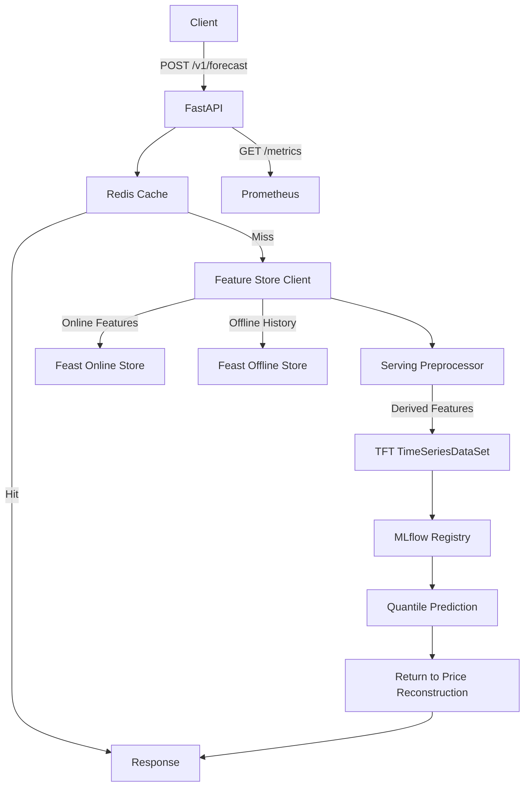

# PolyHorizon Serving Service

See [`docs/SYSTEM_SERVICES.md`](../../docs/SYSTEM_SERVICES.md) for this service's
role in the complete platform and its upstream/downstream contracts.

This service exposes a production‑ready FastAPI API for **TFT multi‑horizon forecasts**. It loads the champion model from **MLflow Model Registry**, fetches features from **Feast**, **derives training‑time features on the server**, caches recent responses in **Redis**, and emits **Prometheus** metrics.

The serving layer is intentionally self‑contained so it can operate even when the Feast online store only provides **raw OHLCV** features.

## What This Service Does
1. Loads the **champion** model alias from MLflow at startup. On the first
   deployment only, if no champion is assigned, the newest governance-qualified READY version is
   bootstrapped as champion; an existing champion is never moved by serving.
2. Fetches the latest `N` rows from Feast (online + offline).
3. Computes **training‑time feature transforms** on the server:
   - `log_close`, `log_volume`
   - time features (`hour`, `minute`, `day_of_week`, `hour_sin`, `hour_cos`, `dow_sin`, `dow_cos`)
   - market calendar flags (`is_holiday`, `is_early_close`)
4. Builds a `TimeSeriesDataSet` with the historical encoder plus a future NYSE
   decoder window (including holidays and early closes), reusing the fitted
   encoders and normalizer persisted with the model.
5. Runs quantile inference and reconstructs price paths (if target is returns).
6. Returns **p10 / p50 / p90** predictions plus % and absolute change.


## Serving Flow


## Data & Feature Expectations
**Feast online store (raw columns)**:
```
symbol,event_timestamp,open,high,low,close,total_volume,rolling_avg_close,rolling_volatility_close
```

**Derived on the server**:
- `log_close`, `log_volume`
- `hour`, `minute`, `day_of_week`
- `hour_sin`, `hour_cos`, `dow_sin`, `dow_cos`
- `is_holiday`, `is_early_close`
- `time_idx`
- `target` (log return)

This ensures serving stays consistent with training even if Feast doesn’t yet store these derived columns.


## Forecast Semantics
Training uses `GroupNormalizer` for the TFT target, so `model.predict(...)` returns
**de‑normalized values in the original target scale**. If the target is returns,
the serving layer reconstructs prices from returns before responding.

Requests for fewer bars use the **first N positions of the full model decoder**
for both quantile predictions and timestamps. With a 39-bar decoder, 1- and
13-bar requests return positions 1 and 1–13 respectively; a 39-bar request returns
all positions. Timestamps follow the NYSE calendar, not the last N rows of the
decoder. Log-return conversion accumulates those same first N returns.
Mismatched prediction/decoder lengths fail rather than silently mislabeling
forecasts. Cache keys use the `v3` format so older timestamp-misaligned cached
responses are not reused after deployment.

Regression tests exercise 1-, 13-, and 39-bar requests across a weekend, for
price and log-return outputs, including cached responses:

```bash
uv run pytest -q tests/unit/serving/test_forecast_service.py
```


## Encoder & Prediction Lengths
The model is trained with:
- **Encoder length**: 780 (3 months × 13 bars/day)
- **Prediction length**: 39 (3 days × 13 bars/day)

Serving defaults should match these values:
```
SERVING_TFT_MAX_ENCODER_LENGTH=780
SERVING_TFT_MAX_PREDICTION_LENGTH=39
SERVING_FORECAST_HORIZON=39
SERVING_HISTORY_ROWS=780
```

## API Endpoints
- `POST /v1/forecast`  
  Request body:
  ```json
  {"symbol":"NVDA","horizon":39,"use_cache":true}
  ```
  Response includes timestamped forecast steps, quantile bands, base price, % change, and model metadata.

- `GET /v1/metadata`  
  Returns the public browser/client contract: supported symbols, horizons,
  bars per market day, currency, timezone, quantiles, timeout, and API-key header.

- `GET /v1/features?symbol=NVDA&limit=50`  
  Returns the most recent feature window used for inference.

- `GET /v1/features/debug?symbol=NVDA&limit=50`  
  Returns **raw Feast features** and **derived features** used for inference.

- `GET /v1/model`  
  Returns model registry metadata and tags for the champion alias.

- `POST /v1/model/reload`  
  Atomically loads the current champion alias after a promotion, without an API restart.

- `GET /metrics`  
  Prometheus metrics (if enabled).

- `GET /v1/health`  
  Health status with model version and load time.

- `GET /v1/health/live` and `GET /v1/health/ready`  
  Separate process liveness and model readiness probes for orchestration.


## Feature Parity Guardrail
Serving performs a **one‑time feature parity check** against the training config
(`polyhorizon/training/configs/training_config.yaml`). If mismatches are detected,
they are logged as warnings so drift doesn’t go unnoticed.


## Local Run
```bash
uv run uvicorn polyhorizon.serving.app.main:app_factory --factory --host 0.0.0.0 --port 8000
```

If you use a custom config file:
```bash
SERVING_CONFIG_PATH=polyhorizon/serving/configs/serving_config.yaml \
uv run uvicorn polyhorizon.serving.app.main:app_factory --factory --host 0.0.0.0 --port 8000
```

## Run With Docker Compose (Local)
```bash
docker compose up -d model-serving
```

This uses `docker-compose.yaml`. The service listens on `http://localhost:8000`.

## Run In Production (Docker Compose + Traefik)
1. Set required envs in `.env`:
```
SERVING_DOMAIN=example.com
TRAEFIK_ACME_EMAIL=you@example.com
```
2. Start Traefik and serving:
```bash
docker compose -f docker-compose.prod.yaml up -d traefik model-serving
```

## Configuration
The default config is `polyhorizon/serving/configs/serving_config.yaml`.  
Environment variables are referenced in that file and documented in `.env.example`.

The initial champion bootstrap is enabled by
`model_registry.bootstrap_champion_alias` in the serving YAML. Disable it in a
custom configuration when alias assignment must be performed exclusively by an
external release process.

Operator-only capabilities are disabled by default:

```text
SERVING_FEATURE_DEBUG_ENABLED=false
SERVING_MODEL_RELOAD_ENABLED=false
```

Enabling either capability requires `SERVING_REQUIRE_API_KEY=true`; configuration
validation rejects an unauthenticated privileged deployment. The metadata
endpoint tells the frontend which controls it may display, while the API still
enforces the capability independently and returns 404 when disabled.

Both capabilities now also require nonempty `SERVING_OPERATOR_API_KEYS`.
Consumer keys in `SERVING_API_KEYS` cannot unlock the console or invoke debugging
or reload. Do not reuse keys across the two lists; configuration rejects overlap.
`GET /v1/ops/session` validates an operator credential and returns enabled
capabilities. Privileged authorization runs before path exemptions and also
applies when ordinary forecast authentication is disabled.

Migration: move the deployment/training `SERVING_RELOAD_API_KEY` from the consumer
list to `SERVING_OPERATOR_API_KEYS`, keeping the caller's existing header and
credential value. Provision separate consumer keys if needed. Production
environment validation enforces this new membership. No credentials are created
automatically. The frontend console is available at `/ops`; credentials remain
in browser memory only.

Product symbols come from the shared [allowlist](../../docs/PRODUCT_SYMBOLS.md).
Forecast and feature endpoints reject unsupported symbols; client metadata
exposes the same list to the frontend.

The deployed target contract must match training:

```text
SERVING_FORECAST_TARGET_TYPE=return
SERVING_RETURN_METHOD=log
```

Startup and champion reload require a complete, versioned `target_contract`
inside the serialized model. It defines per-symbol one-bar log returns,
`target` as the target column, `close` as the base price, and log conversion:
`price[k] = base_price * exp(sum(predicted_returns[:k]))`.
Serving checks this against its configuration and the fitted dataset target
before accepting a model. Missing, unsupported, or mismatched contracts fail
the load; a failed reload leaves the current model in place.

Legacy artifacts must be retrained or re-exported after verifying their actual
training semantics. Editing registry tags is insufficient. Existing deployment
environment files must also use `return` and `log`; changing the template does
not modify an already-running service.

## Champion Promotion Runbook

1. Training registers a version and assigns `@challenger`.
2. Governance evaluates it and, when gates pass, moves `@champion`.
3. Reload each serving replica:

   ```bash
   curl -X POST http://localhost:8000/v1/model/reload
   ```

4. Confirm `/v1/model` reports the expected exact version URI.
5. Confirm `/v1/health/ready` returns `ready` with that version.

Because forecast cache keys include the model version, forecasts from the prior
champion cannot leak into the new deployment.

## CI/CD
The serving pipeline builds and pushes an image to GHCR on every change to serving-related files.
Optional deploy is supported via SSH if the following GitHub secrets are set:
```
DEPLOY_HOST
DEPLOY_USER
DEPLOY_SSH_KEY
DEPLOY_PATH
```
Deploy runs:
```
bash scripts/deploy/serving_rolling_update.sh
```

## Rolling Update (Production)
The deploy step uses a **rolling update** strategy:
1. Pull latest image.
2. Scale `model-serving` to 2 replicas.
3. Wait for health checks.
4. Scale back to 1 replica.

You can run it manually:
```bash
bash scripts/deploy/serving_rolling_update.sh
```

Override behavior with env vars:
```
COMPOSE_FILE=docker-compose.prod.yaml
SERVICE=model-serving
SCALE_UP=2
SCALE_TARGET=1
HEALTH_URL=http://localhost:8000/v1/health
WAIT_SECONDS=120
INTERVAL_SECONDS=5
WARMUP_URL=http://localhost:8000/v1/warmup
```

## Warmup Endpoint
A warmup endpoint is available to prime the model after deploys:
```
GET /v1/warmup
```
It runs a single prediction with `SERVING_WARMUP_SYMBOL` (default `NVDA`).
Enable/disable with:
```
SERVING_WARMUP_ENABLED=true
SERVING_WARMUP_SYMBOL=NVDA
```

## Metrics
Prometheus metrics emitted:
- `serving_requests_total`
- `serving_request_latency_seconds`
- `serving_cache_hits_total`
- `serving_cache_misses_total`
- `serving_model_loads_total`

## Security (API Keys + Rate Limiting)
Serving can enforce API keys and per‑minute rate limits.

Set these in `.env`:
```
SERVING_REQUIRE_API_KEY=true
SERVING_API_KEYS=key1,key2
SERVING_OPERATOR_API_KEYS=separate-operator-key
SERVING_API_KEY_HEADER=X-API-Key
SERVING_RATE_LIMIT_ENABLED=true
SERVING_RATE_LIMIT_PER_MINUTE=60
SERVING_RATE_LIMIT_PREFIX=serving:rate-limit
SERVING_AUTH_EXEMPT_PATHS=/v1/health,/v1/health/live,/v1/health/ready,/v1/metadata,/metrics
```

When enabled, the middleware blocks unauthenticated requests and returns `401`.
If rate limits are exceeded, it returns `429`.
Missing or non-operator credentials on `/v1/ops/session`,
`/v1/features/debug`, and `/v1/model/reload` return `403`. Even public-inference
deployments cannot bypass this operator check.

Forecasts withheld by the freshness gate return HTTP 503 with the existing
`detail`, a stable `code: "stale_features"`, and `Retry-After: 300`. The frontend
distinguishes this from a general readiness outage. Client metadata also exposes
`return_to_price_method` for explaining price conversion alongside the target type.

## Production Load Balancer (Traefik)
For production, `docker-compose.prod.yaml` includes **Traefik** for TLS termination
and routing. Use a single domain to serve both frontend and API:
```
POLYHORIZON_DOMAIN=app.example.com
TRAEFIK_ACME_EMAIL=you@example.com
TRAEFIK_DASHBOARD_DOMAIN=traefik.app.example.com
TRAEFIK_DASHBOARD_USERS=admin:$2y$10$replace_with_htpasswd_hash
```

Traefik routes:
- `/` to the frontend
- `/v1` and `/metrics` to the serving API

This eliminates browser CORS issues and still supports scaling multiple replicas.

## Notes
- This service is **long‑running** and should be deployed like a web API.
- Prefect is not required for serving. Prefect is useful for batch workflows, not HTTP inference.
