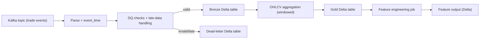

# Streaming Service

See [`docs/SYSTEM_SERVICES.md`](../../docs/SYSTEM_SERVICES.md) for this service's
role in the complete platform and its upstream/downstream contracts.

## Overview
The streaming service ingests trade events from Kafka, writes a Bronze Delta table, aggregates OHLCV bars into a Gold Delta table, and produces feature-ready data for downstream modeling. It is designed for modular configuration and production‑grade logging.

Key modules:
- `src/streaming_job.py` runs the Spark Structured Streaming pipeline (Kafka -> Bronze -> Gold).
- `feature_engineering/main.py` computes rolling features from the Gold table.
- `configs/spark_features.yaml` controls all runtime behavior.

The streaming job can be configured to auto‑shutdown at market close via `market_schedule` in the config.
Metrics for batch size, duration, and dead‑letter counts are pushed to Prometheus Pushgateway.

## Streaming Flow


### Processing Steps
1. Subscribe to Kafka and parse messages into raw schema fields.
2. Apply data quality rules and late-data strategy; invalid rows go to the dead-letter table.
3. Write valid rows to Bronze Delta.
4. Aggregate OHLCV into Gold Delta using windowed aggregation.
5. At calendar close plus grace, drain Bronze and finalize Gold from a pinned version.
6. Compute/validate features in a unique dataset path and persist a completion manifest.
7. Dispatch the feature-store deployment with that manifest; PostgreSQL and Feast
   publication must succeed before the streaming Prefect flow completes.

See [dataset publication](../../docs/DATASET_PUBLICATION.md) for versioned paths,
closing-bar requirements, timestamp alignment, and recovery. The standalone
feature engineering CLI remains a manual utility; production uses the
completion-driven release path.

## Run (Local)
1. Streaming job
```bash
uv run python -m polyhorizon.streaming.src.streaming_job \
  --config polyhorizon/streaming/configs/spark_features.yaml
```

2. Dry run (config + schema validation only)
```bash
uv run python -m polyhorizon.streaming.src.streaming_job \
  --config polyhorizon/streaming/configs/spark_features.yaml \
  --dry-run
```

To skip infrastructure checks during a dry run:
```bash
uv run python -m polyhorizon.streaming.src.streaming_job \
  --config polyhorizon/streaming/configs/spark_features.yaml \
  --dry-run \
  --skip-preflight
```

3. Feature engineering pipeline
```bash
uv run python -m polyhorizon.streaming.feature_engineering.main \
  --config polyhorizon/streaming/configs/spark_features.yaml \
  --rolling-features avg_close,volatility_close,returns
```

## Run (Docker Compose)
1. Build and start Spark cluster
```bash
docker compose build spark-master spark-worker
docker compose up -d spark-master spark-worker
```

2. Submit the streaming job
```bash
docker compose up spark-submit
```

Optional env flags for `spark-submit` (set in `.env`):
- `STREAMING_CONFIG_PATH` (defaults to `/opt/app/polyhorizon/streaming/configs/spark_features.yaml`)
- `SKIP_PREFLIGHT` (true/false)
- `CLEAN_START` (true/false)
- `DRY_RUN` (true/false)

## Run (Production)
Use the production compose file:
```bash
docker compose -f docker-compose.prod.yaml up -d
```

This starts `spark-streaming-service` which runs `spark-submit` in client mode and supervises the driver.

Production image is pulled from GHCR using `GITHUB_REPOSITORY` (set in `.env`):
```
ghcr.io/${GITHUB_REPOSITORY}/spark-streaming:latest
```

## Prefect Deployment
The streaming flow can be scheduled via Prefect to start at US market open (weekdays) and skip holidays.

Deployment entrypoint:
```
polyhorizon/streaming/tasks/spark_streaming_flow.py:spark_streaming_flow
```

Schedule (configured in `prefect.yaml`):
- `cron: 30 9 * * 1-5` in `America/New_York`
- Flow checks NYSE trading calendar and skips holidays automatically

An hourly health deployment also checks whether the streaming app is still running during market hours and restarts it if needed:
- `cron: 0 * * * *` in `America/New_York`

## Config
All settings are controlled by `configs/spark_features.yaml` and env vars referenced inside it. Make sure these are set in your `.env`:
- `SPARK_MASTER_URL`
- `KAFKA_SERVERS`, `KAFKA_TOPIC`
- `BRONZE_PATH`, `GOLD_PATH`, `CHECKPOINT_BRONZE`, `CHECKPOINT_GOLD`
- `DEAD_LETTER_PATH`, `CHECKPOINT_DEAD_LETTER`
- `SEAWEED_S3_ENDPOINT`, `AWS_ACCESS_KEY_ID`, `AWS_SECRET_ACCESS_KEY`

The loader now fails fast if any `${VAR}` placeholders are unresolved.
Kafka epoch-millisecond trade timestamps are converted directly with
`timestamp_millis`, preserving subsecond ordering in Bronze and OHLC selection.
Existing Bronze rows already truncated by older readers are not rewritten.

## Tests
```bash
uv run pytest tests/streaming/feature_engineering
```

E2E streaming test (requires Kafka + Spark + Delta jars):
```bash
RUN_STREAMING_E2E=1 E2E_KAFKA_BOOTSTRAP=localhost:9092 uv run pytest tests/streaming/integration
```

## Troubleshooting

For an isolated end-to-end test of Kafka reads, checkpoint restart, dead-letter
routing, and Prefect's completion-triggered publication, see the
[live Kafka/Prefect rehearsal](../../docs/KAFKA_PREFECT_REHEARSAL.md).

If you see `All masters are unresponsive` or `Cannot call methods on a stopped SparkContext`:
1. Confirm your Spark master is reachable and `SPARK_MASTER_URL` is correct.
2. For local dev without a cluster, set `SPARK_MASTER_URL=local[*]`.
3. If using Docker Compose, use the service name and port that the driver can reach (for example `spark://spark-master:7077` inside the same network).
